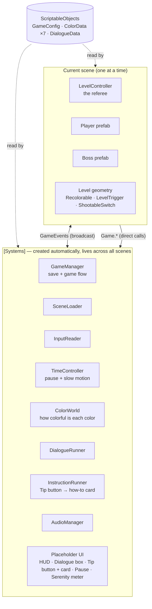
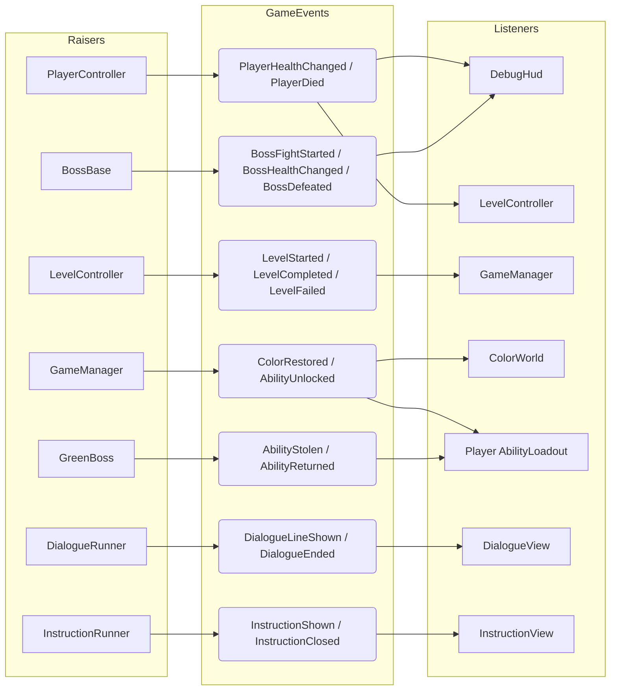
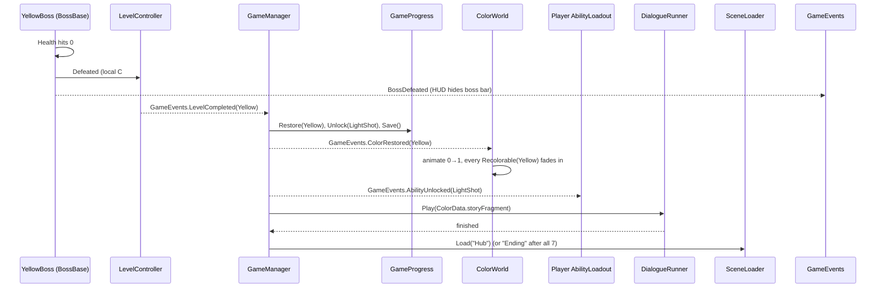

# ROYGBIV — Architecture

A short guide to how the project is organized and how the pieces talk to each other.
**Read sections 1–4 before writing code.** For a per-script reference, dependency tables,
runtime traces and recipes, see **[DEVELOPER_GUIDE.md](DEVELOPER_GUIDE.md)**.

---

## 1. The big picture

The game has two layers:



- **`[Systems]`** is created by `Bootstrapper` *before any scene loads*. You can press Play in **any** scene
  (a boss level, the Sandbox) and everything still works. There is no bootstrap scene to remember.
- **Scenes** contain only the content for that level. Each scene is owned by one person, so there are no merge conflicts.
- **Data** (ScriptableObjects) is the shared source of truth that designers edit in the Inspector.

---

## 2. Folder layout

```
Assets/_Project/
├── Art/Placeholder/        generated squares/circles: replace freely
├── Audio/
├── Data/
│   ├── Colors/             Color_1_Yellow … Color_7_Violet  (ColorData)
│   ├── Dialogue/           Story_<Color>, Dialogue_Ending   (DialogueData)
│   └── Instructions/       Instruction_<Color>               (InstructionData, made by ROYGBIV > Build Instructions)
├── Prefabs/
│   ├── Player.prefab
│   ├── Projectile_PlayerShot / Projectile_EnemyOrb
│   ├── Bosses/Boss_<Color>.prefab
│   └── Violet/                  Violet's level pieces: Checkpoint, Zone, Seal, Shelter, Crystal Gate, Curtain
├── Resources/GameConfig.asset   play order + global tuning (auto-loaded)
├── Resources/ScreenWarp.shader  full-screen distortion used by ScreenWarp (in Resources so builds include it)
├── Scenes/
│   ├── MainMenu · Hub · Ending
│   ├── Level_Yellow … Level_Violet   one per color = district + boss fight
│   └── Sandbox                       test mechanics, no level flow
└── Scripts/
    ├── Core/        Game, GameEvents, GameManager, SceneLoader, TimeController, Bootstrapper, ColorData, GameConfig, GameProgress, Ids
    ├── Input/       InputReader, PlayerIntent, InputModifiers
    ├── Combat/      Health, Hitbox, Projectile, CombatInterfaces (IDamageable, IReflectable, IActor)
    ├── Player/      PlayerController, PlayerMotor, PlayerCombat
    ├── Abilities/   AbilityBase, AbilityLoadout, LightShot, Dash, BlazeStrike, DoubleJump, DownDash, Serenity (HeavySlam: no longer granted)
    ├── Bosses/      BossBase + one folder per color
    ├── Levels/      LevelController, LevelTrigger, ShootableSwitch, CameraFollow
    ├── Effects/     ScreenWarp (camera disorientation: color, wobble, glitch, trails, roll), DashAfterImage
    ├── World/       ColorWorld, Recolorable
    ├── Dialogue/    DialogueData, DialogueRunner
    ├── Instructions/ InstructionData, InstructionRunner   (optional how-to cards, opened from the Tip button)
    ├── Audio/       AudioManager, SceneMusic
    ├── UI/          placeholder IMGUI screens (replace once the art style is picked)
    ├── Debug/       DebugCheats
    └── Editor/      SkeletonBuilder  (menu: ROYGBIV > Build Skeleton)
```

All code is in one namespace, `Roygbiv`, with no assembly definitions. That keeps things simple for a jam.

---

## 3. How parts communicate (the 4 rules)

| # | Situation | Use | Example |
|---|-----------|-----|---------|
| 1 | Components on the **same GameObject / prefab** | **Direct reference** (`GetComponent`, `[SerializeField]`) | `PlayerController` → `PlayerMotor.SetInput()` |
| 2 | Two things **physically touch** | **Interfaces** | `Hitbox` / `Projectile` → `IDamageable.TakeDamage()`; melee → `IReflectable.Reflect()` |
| 3 | Gameplay needs a **global service** to *do* something | **`Game.*` direct call** | `Game.Manager.EnterLevel(ColorId.Red)`, `Game.Audio.PlaySfx(clip)`, `Game.Dialogue.Play(data)` |
| 4 | Something **happened** that others may care about | **`GameEvents` broadcast** | `GameEvents.RaiseBossDefeated(this)` → HUD, LevelController, audio… |

The key one-way rule:

> **Gameplay never references UI, audio or VFX.** Those systems *listen* to `GameEvents` and *read* state.
> That lets the HUD, music and visuals be swapped out entirely once the art style is decided, without touching gameplay.

Event hygiene: **subscribe in `OnEnable`, unsubscribe in `OnDisable`**, always. (Domain reload is turned off
for fast Play mode. `GameEvents` clears itself at the start of each session, but objects that stay
subscribed after being destroyed will still throw errors.)

### Who listens to what



---

## 4. The core loop, step by step

This is what happens when the Yellow boss dies:



**Who owns what:**

- **Boss**: only fights and dies. It never loads scenes or touches the save.
- **LevelController**: the referee. Decides win/lose for *this* scene and raises `LevelCompleted` / `LevelFailed`.
- **GameManager**: the *only* writer of `GameProgress`. It applies rewards and moves the game on.

Player death: `Health.Died` → `GameEvents.PlayerDied` → `LevelController.Fail()` → `LevelFailed` → `GameManager` reloads the scene.

---

## 5. Key building blocks

### Colors & progression (`ColorData`, `GameConfig`)
- `ColorId` is in spectrum order (ROYGBIV). **The play order is set in `GameConfig.colorOrder`**:
  Yellow → Orange → Red → Green → Blue → Indigo → Violet.
- Each `ColorData` holds the display name, tint, emotion, scene name, granted ability, story fragment and music layer.
- A color unlocks once every color before it in the play order has been restored (`GameManager.IsUnlocked`).

### Input (`InputReader` → `PlayerIntent` → gameplay)
- Bindings are defined in **one place**: `InputReader.Awake`. The defaults are:
  Move WASD/Arrows · Jump Space · Attack Left Click (hold + release = Blaze Strike) · Shoot Right Click / C · Dash Shift
  (hold Down too = Down Dash) · Serenity Q · Pause Esc.
- Gameplay reads `Game.Input.Intent` and never reads the keyboard directly. This makes three things possible:
  - **Dialogue and pause freeze the player** through `Game.Input.BlockGameplay()` / `UnblockGameplay()`.
  - **Indigo scrambles the controls** by pushing `IInputModifier`s (mirror, swap jump/attack, swap shoot/dash, input delay),
    one set per phase, and warps the screen to match with `ScreenWarp`.
  - Gamepad support works for free.

### Time (`TimeController`, `Game.Time`)
- **Nothing writes `Time.timeScale` or `Time.fixedDeltaTime` directly.** Ask `Game.Time`:
  `Pause(owner)` / `Resume(owner)` (pause menu, Tip card: any pause = time stopped) and `SetScale(owner, s)` / `ClearScale(owner)`
  (slow motion: requests multiply). A pause wins over every scale and lifting it puts the slow motion back. `fixedDeltaTime`
  follows the scale so physics stays smooth. Scene loads reset everything.
- Gameplay timers use scaled time (`Time.time`, `deltaTime`, `WaitForSeconds`), so Indigo's **Serenity** slows the boss, its attacks,
  projectiles and traps (and the player) for free. Only UI, fades and audio use unscaled time. Keep it that way.

### Combat (`Health`, `Hitbox`, `Projectile`, interfaces)
- **Convention:** *Hurtboxes* (bodies) are **non-trigger** colliders. *Hitboxes, projectiles and zones* are **triggers**.
- `IDamageable` covers anything that reacts to a hit: the player, bosses, and `ShootableSwitch` (Team.Neutral).
- `Team` decides who can hurt whom (`Combat.CanHurt`). Projectiles pass through friendly targets.
- `IReflectable`: the player's melee `Hitbox` (`reflectsProjectiles = true`) sends enemy orbs back. This is the Yellow tutorial mechanic.

### Actors & abilities (`IActor`, `AbilityBase`, `AbilityLoadout`)
- `IActor` is implemented by **both** `PlayerController` and `BossBase` (body, facing, aim, health, grounded, movement lock).
- An ability is a component under its owner that only talks to its `IActor`. **The same ability code runs on the player or on a boss.**
- `enabled == unlocked`. `AbilityLoadout` manages that flag:
  - Player (`syncWithProgress = true`) mirrors the save and reacts to `AbilityUnlocked` / `AbilityStolen` / `AbilityReturned`.
  - Bosses call `Grant()` / `TryActivate()` from their AI.
- **Green boss (steals abilities):** `GameEvents.RaiseAbilityStolen(id)` disables the ability on the player, and the boss calls `Grant(id)` on its own copy and uses it.
  Everything is returned on defeat, or when the scene unloads.

### Bosses (`BossBase`)
Subclass it and write a single method:
```csharp
protected override IEnumerator RunPhase(int phase)
{
    // ONE attack cycle. Called repeatedly until the boss dies.
    Fire(orbPrefab, AimDirection);
    yield return Wait(1.5f);
}
```
Phases come from the health thresholds set in the Inspector. Optional hooks are `OnFightStarted`, `OnPhaseChanged` and `OnDefeated`.
Helpers available to subclasses: `Player`, `AimDirection`, `Fire(...)`, `Wait(...)`.

### Levels (`LevelController`, `LevelTrigger`)
- There is one `LevelController` per level scene, set with its `ColorId`. A level can be won in three ways:
  - **Defeat the boss assigned to `LevelController.boss`.**
  - **Enter a `LevelTrigger` set to `CompleteLevel`.** This is how Blue's climb ends.
  - **Any script calls `LevelController.Current.Complete()`.**
- `LevelTrigger` actions: `StartBoss` (arena door), `CompleteLevel`, `KillPlayer` (pits), plus a UnityEvent for anything else.
- `LevelController.Start` plays `introDialogue` (if any), then starts the boss right away. Nothing explains the fight
  up front: during the level a small **Tip button** (top-right) opens the color's **how-to card** (`ColorData.instruction`),
  a short animated demo, as often as the player likes. `Game.Instructions` owns it: while the card is open, time is frozen
  and gameplay input blocked. Mouse only (no hotkey); it closes with its X, the Tip button, Z / Enter or Esc.
  No `instruction` on the ColorData = no Tip button (Violet for now).
- Genre-shifting is handled per level. Examples:
  - Orange has a `ChaseDirector` that drives `PlayerMotor.autoRunSpeed` and `CameraFollow.autoScrollSpeed`, and a `ChaseCourse` that builds an endless track.
  - Blue is a vertical layout.
  - Indigo casts a curse each phase: input modifiers + a `ScreenWarp` look (any boss can use `ScreenWarp.Main`).
  - **Violet** (the final exam) is a run + a duel, and a normal **hand-editable** level. The terrain is painted in a
    `Grid > Tilemap` with the Violet palette (set up like Level_Yellow's). Every gameplay piece is a scene object under
    `Violet`: checkpoint banners, one `VioletZone` per long-range attack, the Royal Rain halls, the Crystal Gate, the needle
    curtains, the arrival at the foot of the king's hill, the far king's anchor and the arena. `VioletApproach` reads them
    at Start and runs the intro camera pull; the run (camera look-ahead, the king always on screen as a big distant figure,
    each zone's attack starting with his gesture); the arrival cinematic (letterbox, wipe cut to the arena, he draws his
    planted greatsword, name card); then `StartBoss`. Only projectiles and attack visuals are spawned at runtime.
    `VioletCheckpoint` remembers the last checkpoint across death reloads. The old code-built layout was migrated once with
    **ROYGBIV > Bake Violet Level Into Scene**; an unbaked scene logs one error and runs nothing. How to edit it:
    DEVELOPER_GUIDE.md, section 8, "Edit Violet's level".

### Recoloring the world (`ColorWorld`, `Recolorable`) — art-style agnostic
- `ColorWorld` stores a value from 0 to 1 for each color, animated when the color is restored. It also sets shader globals:
  `_Roygbiv_Red` … `_Roygbiv_Violet` and `_Roygbiv_Saturation`.
- `Recolorable` goes on any sprite or tilemap that belongs to a color. By default it lerps the tint from gray (fine for flat
  placeholder sprites). Tick **Desaturate** for painted art: it swaps in `Resources/RecolorSprite.shader`, which grays out
  the texture itself and fades the painted colors back in. Nothing else in the project needs to change.

---

## 6. Where each role works

| Role | Works in | Mostly touches |
|------|----------|----------------|
| Gameplay programmer | `Scripts/Player`, `Combat`, `Abilities`, `Bosses/*` | Prefabs, `BossBase` subclasses |
| Assistant programmer | `Scripts/Core`, `Levels`, integration | `GameConfig`, scenes in Build Settings |
| Level / narrative designer | `Scenes/Level_*`, `Data/Dialogue`, `Data/Colors` | `LevelTrigger`, `ShootableSwitch`, `DialogueData` assets |
| Artist / animator | `Art/`, sprites on prefabs, later `Recolorable.Apply` / shaders | Replace `Visual` children on prefabs |
| Audio / VFX | `Audio/`, `ColorData.musicLayer`, `SceneMusic` | Listen to `GameEvents` (never edit gameplay code to trigger a sound) |

**Merge-conflict rules for Unity:** one person per scene at a time. Build reusable things as **prefabs**.
Talk to each other before editing someone else's scene or prefab.

---

## 7. How to…

| Task | Steps |
|------|-------|
| **Test my boss directly** | Open `Level_<Color>` and press Play. Use **F1–F7** to grant earlier colors/abilities, **F9** win the level, **F10** wipe the save. In Level_Violet: **PageDown/PageUp** next/previous checkpoint, **Home** the duel, **End** Twin Blades (abilities are granted automatically in the editor). |
| **Edit Violet's level** | Open `Level_Violet`. Paint terrain with **Window > 2D > Tile Palette > Violet** on `Grid/Tilemap`; move or duplicate the objects under `Violet` (Checkpoints, Zones, Hazards, Arrival, Far King, Arena). Details: DEVELOPER_GUIDE.md, section 8. |
| **Add an ability** | 1. Add a value at the **end** of `AbilityId`. 2. Subclass `AbilityBase`. 3. Add it under `Player/Abilities`. 4. Set `grantedAbility` in that color's `ColorData`. |
| **Add a boss mechanic** | Edit `Bosses/<Color>/<Color>Boss.cs`. Each stub has a TODO plus the design notes. |
| **Edit a how-to card** | Select `Data/Instructions/Instruction_<Color>`: caption (`[LMB]`, `[C]`, `[Space]`… become keycaps), keys, demo, sprites. Missing? Run **ROYGBIV > Build Instructions**. |
| **Add dialogue** | Create > ROYGBIV > Dialogue. Assign it to `ColorData.storyFragment` or `LevelController.introDialogue`, or call `Game.Dialogue.Play(asset)`. |
| **React to something with sound/VFX** | Subscribe to the matching `GameEvents` event in `OnEnable` and unsubscribe in `OnDisable`. |
| **Add a new global event** | Add the `event`, a `Raise*` method, **and a line in `ResetAll()`** in `GameEvents.cs`. |
| **Regenerate a scene/prefab** | Delete it, then run **ROYGBIV > Build Skeleton** (existing assets are never overwritten). |

**Never reorder or remove values in `ColorId` / `AbilityId` / `Team`.** They are saved as numbers in assets and in the save file.
