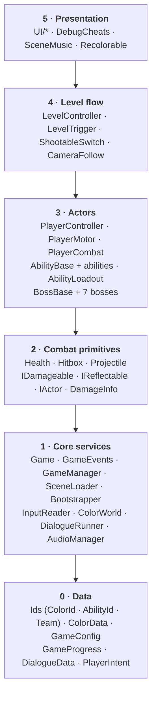

# ROYGBIV — Developer Guide

The complete reference for working in the codebase: what every script does, what it depends on, who
depends on it, and how the scripts work together at runtime.

> **Start with [ARCHITECTURE.md](ARCHITECTURE.md)** for the 5-minute overview (layers + the 4 communication rules).
> This guide is the deep dive. Keep both open while you work.

**Contents**

1. [Dependency map](#1-dependency-map)
2. [Lifecycle & execution order](#2-lifecycle--execution-order)
3. [Script reference](#3-script-reference) — every script: purpose · API · depends on · used by · gotchas
4. [Event reference](#4-event-reference) — every `GameEvents` event: who raises, who listens
5. [Runtime flows](#5-runtime-flows) — step-by-step traces of what happens in common situations
6. [Prefab & scene anatomy](#6-prefab--scene-anatomy)
7. [Conventions](#7-conventions)
8. [Recipes](#8-recipes) — how to add a boss, an ability, a level, an event…
9. [Debugging & pitfalls](#9-debugging--pitfalls)
10. [Known limitations / TODO](#10-known-limitations--todo)

---

## 1. Dependency map

### 1.1 Layers

Dependencies point **downward only**. A script may use anything in a lower layer and nothing in a higher one.
UI sits at the top: it can read everything, but nothing reads it.



There are two deliberate exceptions, so treat them with care:

| Exception | Why it's acceptable |
|---|---|
| `GameEvents` (layer 1) mentions `BossBase` (layer 3) in event signatures | Listeners need the boss to read its name and HP. It's a type reference only; `GameEvents` never calls into bosses. |
| `Bootstrapper` (layer 1) adds the placeholder UI components (layer 5) | It's the composition root, the one place allowed to know about everything. When you replace the UI, edit the 3 `AddComponent` lines there. |

### 1.2 Who depends on whom (per script)

"→" means *uses*. **Bold** names are the things you'll touch most.

| Script | Uses (depends on) | Used by |
|---|---|---|
| `Ids` | — | everything |
| `ColorData` | Ids, DialogueData | GameConfig, GameManager, AudioManager, HubScreen, DebugHud |
| `GameConfig` | ColorData | Game, Bootstrapper, GameManager, ColorWorld, AudioManager, UI, DebugCheats |
| `GameProgress` | Ids, `PlayerPrefs` | GameManager (writes); AbilityLoadout, ColorWorld, AudioManager, GreenBoss, UI (read via `Game.Progress`) |
| `PlayerIntent` | — | InputReader, InputModifiers, AbilityBase & abilities, PlayerController, DialogueRunner, PauseMenu |
| `DialogueData` | — | ColorData, LevelController, EndingScreen, DialogueRunner, GameEvents |
| **`Game`** | all layer-1 services, GameConfig, GameProgress | almost everything above layer 1 |
| **`GameEvents`** | Ids, BossBase (type), DialogueData | see [§4](#4-event-reference) |
| `Bootstrapper` | Game, GameConfig, every `[Systems]` component | Unity (auto-run) |
| `GameManager` | Game, GameProgress, GameEvents | MainMenuScreen, HubScreen, PauseMenu, EndingScreen, DebugCheats |
| `SceneLoader` | GameEvents, `SceneManager` | GameManager, PauseMenu |
| `InputReader` | PlayerIntent, IInputModifier, Unity Input System | PlayerController, DialogueRunner, InstructionRunner, PauseMenu, IndigoBoss, InstructionView (pointer blocker), AbilityBase (indirectly) |
| `InputModifiers` | PlayerIntent, `Time` (delay) | IndigoBoss |
| `ScreenWarp` (+ `Resources/ScreenWarp.shader`) | Camera, `Resources` | IndigoBoss (any boss or level can use it) |
| `ColorWorld` | Game, GameEvents, shader globals | Recolorable, GameManager.NewGame |
| `DialogueRunner` | Game.Input, GameEvents, DialogueData | GameManager, LevelController, EndingScreen |
| `InstructionData` | — | ColorData, InstructionRunner, InstructionView, GameEvents |
| `InstructionRunner` | Game.Input, Game.Config, Game.Dialogue, Game.Scenes, GameEvents, InstructionData, `SceneManager`, `Time.timeScale` | InstructionView, PauseMenu |
| `AudioManager` | Game.Config, Game.Progress | SceneMusic, any gameplay that plays SFX |
| `CombatInterfaces` | Ids (Team), Health | Health, Hitbox, Projectile, abilities, PlayerController, BossBase, ShootableSwitch |
| **`Health`** | IDamageable, Combat, `Rigidbody2D` | PlayerController, BossBase, abilities (i-frames), LevelTrigger, CameraFollow, DebugCheats |
| `Hitbox` | IDamageable, IReflectable, DamageInfo | PlayerCombat, BlazeStrike, HeavySlam |
| `Projectile` | IReflectable, IDamageable, Combat | LightShot, BossBase.Fire, all bosses with ranged attacks |
| `HitFeedback` | Health, CameraFollow | boss prefabs |
| `PlayerMotor` | `Rigidbody2D` | PlayerController |
| `PlayerCombat` | Hitbox | PlayerController |
| **`PlayerController`** | PlayerMotor, Health, PlayerCombat, AbilityLoadout, Game.Input, GameEvents | BossBase (`Player`), CameraFollow, LevelTrigger, OrangeBoss, BlueBoss, DebugHud, DebugCheats |
| `AbilityBase` | IActor, PlayerIntent | AbilityLoadout, all abilities |
| `AbilityLoadout` | AbilityBase, Game.Progress, GameEvents | PlayerController, GreenBoss, DebugHud |
| Abilities (`LightShot`, `Dash`, `BlazeStrike`, `DoubleJump`, `DownDash`, `HeavySlam`) | AbilityBase, IActor, Projectile / Hitbox / Health | AbilityLoadout (player & Green boss) |
| **`BossBase`** | Health, IActor, PlayerController.Instance, Projectile, GameEvents | LevelController, DebugHud, 7 bosses |
| `YellowBoss` … `VioletBoss` | BossBase (+ see each) | prefab only |
| **`LevelController`** | BossBase, DialogueData, Game.Dialogue, GameEvents | LevelTrigger, PauseMenu, DebugHud, DebugCheats |
| `LevelTrigger` | LevelController.Current, PlayerController | scenes |
| `ShootableSwitch` | IDamageable | scenes (UnityEvent → anything), CageTrap |
| `CameraFollow` | PlayerController.Instance, `Camera.main` | scenes, HitFeedback (`Shake`), ChaseDirector |
| Orange chase (`ChaseDirector`, `ChaseCourse`, `CageTrap`, `SpringPad`, `FlatSprite`) | CameraFollow, PlayerMotor, LevelController, OrangeBoss, ShootableSwitch, Breakable, Hazard | Level_Orange, OrangeBoss |
| `Breakable`, `Hazard` | IDamageable / PlayerController | ChaseCourse |
| `Recolorable` | Game.Colors | scenes, boss prefabs |
| `SceneMusic` | Game.Audio | scenes |
| UI (`DebugHud`, `DialogueView`, `PauseMenu`, `MainMenuScreen`, `HubScreen`, `EndingScreen`) | Game, GameEvents, LevelController, PlayerController | nothing (top of the stack) |
| `DebugCheats` | Game, LevelController, PlayerController, Input System `Keyboard` | nothing |
| `SkeletonBuilder` (Editor) | everything | Unity menu |

---

## 2. Lifecycle & execution order

### 2.1 Order of things when you press Play

```
SubsystemRegistration   GameEvents.ResetAll(), Game.ResetAll()        (wipe statics: domain reload is OFF)
BeforeSceneLoad         Bootstrapper.Init()
                          ├─ Game.Config = Resources/GameConfig
                          └─ new "[Systems]" (DontDestroyOnLoad), AddComponent in this order:
                             InputReader → SceneLoader → GameManager → ColorWorld → DialogueRunner
                             → InstructionRunner → AudioManager → PauseMenu → DialogueView
                             → InstructionView → DebugHud → DebugCheats
                             (each Awake runs immediately inside AddComponent)
Scene loads             Awake → OnEnable for every scene object
                        Start for everything (incl. [Systems]: ColorWorld.Start syncs colors, AudioManager.Start builds layers)
Every frame             InputReader.Update   (DefaultExecutionOrder -100: always first)
                        …all other Updates (PlayerController reads the fresh Intent)
                        FixedUpdate: PlayerMotor physics
```

**What you can rely on:**

| When | Available |
|---|---|
| Any scene object's `Awake` | `Game.Config`, `Game.Manager`, `Game.Progress`, `Game.Input`, `Game.Colors`, … all non-null |
| Any `Update` | `Game.Input.Intent` is already this frame's input |
| `Start` | Other scene objects' `Awake`/`OnEnable` have run (e.g., `PlayerController.Instance` set) |

**What you can NOT rely on:**

- The order of `Awake`/`Start` *between two scene objects*. If B needs A to be set up, do it in `Start`, not `Awake`.
- Statics surviving between Play sessions. Domain reload is disabled, so **every new static field needs a reset**
  (see `GameEvents.ResetAll` / `Game.ResetAll`). Instance-like statics (`PlayerController.Instance`,
  `LevelController.Current`) clear themselves in `OnDestroy`.

### 2.2 Scene change

`Game.Scenes.Load(name)` does the following:
1. Fades to black (unscaled time).
2. Sets `Time.timeScale = 1`.
3. Calls `LoadSceneAsync`, which destroys the old scene's objects. Their `OnDisable` runs and unsubscribes them from events.
4. Raises `GameEvents.SceneLoaded(name)`.
5. Fades back in.

`[Systems]` survives scene changes. Everything else is rebuilt from scratch, including the **Player, which is
a fresh prefab instance in every level**. Its abilities come back from the save, not from the previous scene.

---

## 3. Script reference

Format for each entry: **Purpose**, then **API** (the public members you'll actually call), **Inspector**
(serialized fields), **Talks to**, **Gotchas**, and **Extend** where relevant.

### 3.1 Data (`Scripts/Core`, `Scripts/Dialogue`, `Scripts/Input`)

#### `Ids.cs` — `ColorId`, `AbilityId`, `Team`
- **Purpose:** Shared vocabulary. `ColorId` is in spectrum order (Red…Violet). The *play* order is in `GameConfig`.
- **Gotchas:** These values are stored as **integers** in assets and save files. **Append only. Never reorder or delete.**
  Reordering silently changes every existing asset and save.

#### `ColorData.cs` — ScriptableObject, one per color (`Data/Colors/Color_N_<Name>`)
- **Purpose:** All per-color design data in one asset.
- **Fields:** `id`, `displayName`, `tint`, `emotion`, `sceneName`, `instruction`, `grantedAbility`, `storyFragment`, `musicLayer`.
- **Talks to:** read via `Game.Config.Get(colorId)`.
- **Gotchas:** `sceneName` must match a scene in Build Settings exactly. `grantedAbility` needs a matching ability
  component on the Player prefab, or you'll see the warning "has no component for ability".

#### `GameConfig.cs` — ScriptableObject at `Resources/GameConfig.asset`
- **Purpose:** Global tuning and the play order.
- **API:** `Get(ColorId) → ColorData`, `IndexOf(ColorId) → int`.
- **Fields:** `colorOrder` (play order), `mainMenuScene`, `hubScene`, `endingScene`, `returnToHubDelay`, `recolorDuration`, `respawnDelay`.
- **Gotchas:** The asset must stay at `Resources/GameConfig` (`GameConfig.ResourcePath`). If it's missing, the
  Bootstrapper logs a warning and uses an empty config, and nothing will be unlocked.

#### `GameProgress.cs` — plain `[Serializable]` class (the save file)
- **Purpose:** What the player has achieved: `restoredColors`, `unlockedAbilities`.
- **API:** `IsRestored`, `HasAbility`, `RestoredCount`, `Restore`, `Unlock`, `Save()`, static `Load()`, `HasSave`, `DeleteSave()`.
- **Storage:** JSON in `PlayerPrefs` under `roygbiv.save`.
- **Rule:** **Only `GameManager` writes to this.** Everyone else reads `Game.Progress` and listens for events.
- **Gotchas:** The Editor and your local builds share one save per machine. Press **F10** to wipe it.

#### `DialogueData.cs` — `DialogueLine` struct + `DialogueData` ScriptableObject
- **Purpose:** A conversation: a list of `{speaker, text}`. Create one with *Create > ROYGBIV > Dialogue*.
- **Used by:** `ColorData.storyFragment`, `LevelController.introDialogue`, `EndingScreen.endingDialogue`, or any code via `Game.Dialogue.Play(asset)`.

#### `PlayerIntent.cs` — struct
- **Purpose:** One frame of player intention, independent of the input device.
- **Fields:** `move`, `jumpPressed/Held`, `attackPressed/Held/Released`, `shootPressed`, `aimPoint`/`hasAimPoint` (mouse world position; false on gamepad), `dashPressed`, `confirmPressed`, `pausePressed`.
- **API:** `ClearGameplay()` zeroes everything except confirm and pause.
- **Extend:** To add an action, add a field here, bind it in `InputReader`, clear it in `ClearGameplay()`, and read it in an ability or controller.

### 3.2 Core services (`Scripts/Core`, all live on `[Systems]`)

#### `Game.cs` — static service locator
- **Purpose:** The single access point for persistent systems.
- **API:** `Game.Config`, `Game.Manager`, `Game.Progress`, `Game.Scenes`, `Game.Input`, `Game.Colors`, `Game.Dialogue`, `Game.Instructions`, `Game.Audio`.
- **Rule:** Use `Game.*` to **command** a service ("load this scene", "play this dialogue"). Use `GameEvents` to **announce** something.
- **Gotchas:** Setters are `internal` and only `Bootstrapper` sets them. Never cache these in fields across scenes; just call `Game.X` each time.

#### `GameEvents.cs` — static event bus
- **Purpose:** One-to-many announcements between systems that shouldn't know about each other.
- **API:** `event`s plus matching `Raise*()` methods. See [§4](#4-event-reference) for the full table.
- **Rules:**
  1. Subscribe in `OnEnable`, unsubscribe in `OnDisable`, every time.
  2. Name events in the past tense. They describe facts, not requests.
  3. When you add an event, also add it to `ResetAll()`.
- **Gotchas:** Raising an event with no listeners is fine (`?.Invoke`). A listener that forgot to unsubscribe
  throws `MissingReferenceException` after its scene unloads.

#### `Bootstrapper.cs` — static, auto-runs
- **Purpose:** The composition root. It builds `[Systems]` before the first scene, so **any scene is playable directly**.
- **Talks to:** every `[Systems]` component and `Game`.
- **Extend:** To add a new persistent service:
  1. Write the MonoBehaviour.
  2. Add a property to `Game` (and to `Game.ResetAll`).
  3. Add `Game.X = systems.AddComponent<X>();` here. Services listed earlier can be used by later ones in `Awake`.

#### `GameManager.cs` — game flow and save owner
- **Purpose:** Menu → Hub → Level → reclaim → Hub … → Ending. It is the only writer of `GameProgress`.
- **API (commands):** `NewGame()`, `ContinueGame()`, `ReturnToMenu()`, `ReturnToHub()`, `EnterLevel(ColorId)`, `RestoreColor(ColorId)`.
- **API (queries):** `Progress`, `IsUnlocked(ColorId)` (linear: all previous colors in play order are restored), `AllColorsRestored`.
- **Listens:** `LevelCompleted` → `ReclaimSequence`, `LevelFailed` → `RespawnSequence`.
- **Raises:** `ColorRestored`, `AbilityUnlocked` (inside `RestoreColor`).
- **ReclaimSequence:**
  1. Calls `RestoreColor`, which saves and raises the events.
  2. Plays `storyFragment`, the first time only.
  3. Waits `returnToHubDelay`.
  4. Loads the Hub, or the Ending scene if all colors are restored.
- **Gotchas:** Replaying a finished level still reaches `LevelCompleted`, but `RestoreColor` does nothing and the story
  fragment is skipped. The waits use scaled time, so pausing during the reclaim sequence delays it.

#### `SceneLoader.cs`
- **Purpose:** Fade, then load the scene asynchronously. Always use this rather than calling `SceneManager` directly, so the fades, the `SceneLoaded` event and the time-scale reset all happen.
- **API:** `Load(string)`, `Reload()`, `IsLoading`, `Current`.
- **Raises:** `SceneLoaded`.
- **Gotchas:** `Load` is ignored while another load is running. A scene that isn't in Build Settings logs an error and doesn't load.
  The fade is drawn with IMGUI. Replace it when the real UI exists.

#### `InputReader.cs` — `[DefaultExecutionOrder(-100)]`
- **Purpose:** Reads the devices once per frame and publishes `Intent`.
- **API:**
  - `Intent`
  - `BlockGameplay()` / `UnblockGameplay()`, which are ref-counted and must be paired
  - `GameplayEnabled`
  - `AddModifier`, `RemoveModifier`, `ClearModifiers`
  - `AddPointerBlocker(Func<Vector2,bool>)` / `RemovePointerBlocker`: on-screen UI clicked during play (the Tip button)
    registers a hit test (screen pixels, origin bottom-left). A mouse press that starts over it doesn't reach gameplay:
    attack and shoot are masked until the button is released, so clicking the UI doesn't swing, charge or fire.
- **Bindings:** Defined in code in `Awake` (keyboard and gamepad). This is the **only** place to change controls.
- **Pipeline:** device → raw intent → (press over a pointer blocker: mask attack / shoot) → (if blocked: `ClearGameplay`) → each `IInputModifier` in order → `Intent`.
- **Gotchas:**
  - Confirm is also bound to Z and X. While dialogue is open, gameplay is blocked, so those presses don't also jump or attack.
  - Each Block call needs exactly one matching Unblock. An extra Block leaves the player frozen.
  - The project's `InputSystem_Actions.inputactions` asset is **not used**.

#### `InputModifiers.cs` — `IInputModifier` + `InvertHorizontalModifier`, `SwapJumpAndAttackModifier`, `SwapShootAndDashModifier`, `DelayedInputModifier`
- **Purpose:** Transforms the intent. Built for Indigo's disorientation mechanic, but usable anywhere (status effects, tutorials).
- **Notes:** The jump/attack swap also re-derives `attackReleased`, so Blaze Strike charges and fires on the same key.
  `DelayedInputModifier(seconds)` replays every press exactly once, late; aim, confirm and pause stay live.
- **Extend:** Implement `PlayerIntent Modify(PlayerIntent i)`. Always remove the modifier when your effect ends
  (Indigo removes its modifiers when a phase ends, in `OnDefeated` and in `OnDestroy`).

#### `ColorWorld.cs` (`Scripts/World`)
- **Purpose:** The visual "how colorful is each color" state, from 0 to 1 per color, animated on restore.
- **API:** `GetAmount(ColorId)`, `OverallSaturation`, `SyncWithProgress()`, `event AmountChanged(ColorId, float)`.
- **Shader globals:** `_Roygbiv_Red` … `_Roygbiv_Violet`, `_Roygbiv_Saturation`.
- **Listens:** `ColorRestored` → animates over `GameConfig.recolorDuration`.
- **Why it exists:** Visuals read this rather than the save file. That keeps "how recoloring looks" fully separate from game flow.

#### `DialogueRunner.cs` (`Scripts/Dialogue`)
- **Purpose:** Steps through a `DialogueData`, blocks gameplay input while it runs, and raises events. It doesn't draw anything.
- **API:** `Play(DialogueData) → Coroutine`, `IsPlaying`. From a coroutine: `yield return Game.Dialogue.Play(d);`
- **Raises:** `DialogueStarted`, `DialogueLineShown` (once per line), `DialogueEnded`.
- **Gotchas:** If a second `Play` arrives while one is running, it queues behind it. Each line advances on `confirmPressed`.
  Lines are rich text: the story fragments color the color word and ability name with `<color=#...>`.

#### `InstructionData.cs` + `InstructionRunner.cs` (`Scripts/Instructions`)
- **Purpose:** An optional how-to card for the level's boss, opened by the player from the on-screen **Tip button**;
  nothing pops up on its own. `InstructionData` (*Create > ROYGBIV > Instruction*, one per color in `Data/Instructions`,
  referenced by `ColorData.instruction`) holds a one-line `caption` (+ optional `subCaption`, unused by the current cards),
  the `keys` the demo presses, which `demo` to play (`InstructionDemo`: Reflect, ShootLatch, Overheat, Steal, Climb,
  FlipControls, None), an `accent` color and the demo's sprites. `[LMB]` `[RMB]` `[Left]` `[Space]`… in a caption draw as keycaps.
- **API:** `Game.Instructions.LevelCard`, `CanOpen` (the button shows when true), `IsOpen`, `Open()`, `Close()`, `Toggle()`, `BlocksPause`.
- **Flow:** `LevelStarted` makes the level's card available; `InstructionView` draws the Tip button while `CanOpen` and calls
  `Toggle()` on a click. `Open()` blocks gameplay input and sets `Time.timeScale = 0` (so the Orange chase doesn't scroll);
  `Close()` restores both exactly as they were. Open it as often as you like.
- **Closes on:** the card's X or the Tip button (view → `Close` / `Toggle`), confirm (Z / Enter) or Esc (read in `Update`),
  the level completing / failing (F9 too), or the scene changing.
- **Button hidden when:** the ColorData has no `instruction` (Violet for now), dialogue is playing, the pause menu is open
  (`PauseChanged`), the level is won or lost, or a scene is loading.
- **Raises:** `InstructionShown(color, data)`, `InstructionClosed`. It draws nothing; `InstructionView` does.
- **Gotchas:**
  - No keyboard shortcut opens it, on purpose: it's mouse only.
  - The click must not also attack: `InstructionView` registers the button and the card's X with
    `InputReader.AddPointerBlocker`, because IMGUI only sees the click after gameplay's `Update` has read the input.
  - `PauseMenu` checks `BlocksPause` (open, or closed this frame), so the Esc that closes the card doesn't also pause.
  - Confirm / Esc are ignored for `minShowTime` after opening.
  - Rebuild the default cards with **ROYGBIV > Build Instructions** (keeps existing ones, links empty ColorData except Violet)
    or **Reset Instructions to Defaults**.

#### `AudioManager.cs` (`Scripts/Audio`)
- **Purpose:** Music, one-shot SFX, and adaptive music layers.
- **API:** `PlayMusic(clip)`, `StopMusic()`, `PlaySfx(clip, volume)`.
- **Adaptive music:** Each `ColorData.musicLayer` becomes a looping source. It fades in once that color is restored, while music is playing.
- **Gotchas:** The layer clips must match the base track's length and tempo, because they all restart together in `PlayMusic`.

### 3.3 Combat primitives (`Scripts/Combat`)

#### `CombatInterfaces.cs`
| Type | What | Implemented by |
|---|---|---|
| `DamageInfo` | `amount`, `sourceTeam`, `knockback`, `source` | — |
| `IDamageable` | `Team`, `bool TakeDamage(in DamageInfo)` | `Health`, `ShootableSwitch` |
| `IReflectable` | `CanBeReflected`, `Reflect(Team, Vector2)` | `Projectile` |
| `IActor` | `Team`, `Root`, `Body`, `Health`, `FacingSign`, `AimDirection`, `IsGrounded`, `MovementLocked` | `PlayerController`, `BossBase` |
| `Combat.CanHurt(a, b)` | Neutral hurts and is hurt by everyone; otherwise only opposite teams | — |

`IActor` is what lets an ability run on either the player or a boss.

#### `Health.cs` — implements `IDamageable`
- **Purpose:** HP for anything.
- **API:**
  - Properties: `Current`, `Max`, `Fraction`, `IsDead`, `Invulnerable` (settable), `DamageFilter` (optional veto; Yellow uses it to take damage only from reflected orbs)
  - Methods: `TakeDamage`, `Heal`, `Kill`
- **Events (local C#, not global):** `Changed(current, max)`, `Damaged(DamageInfo)`, `Died`.
- **Inspector:** `team`, `maxHealth`, `hitInvulnerability`.
- **TakeDamage rejects the hit when:** the target is dead, invulnerable, still in post-hit i-frames, or on a team it can't be hurt by. Otherwise it applies knockback, but only to a **Dynamic** body.
- **Pattern:** The owning script (`PlayerController`, `BossBase`) subscribes to these local events and re-raises the relevant ones globally.
- **Gotchas:** `Invulnerable` is a single shared flag used by Dash, Red, Orange, Blue and god mode. Whoever sets it last wins.

#### `Hitbox.cs`
- **Purpose:** A trigger that damages things while active.
- **API:** `Open(seconds)`. Public fields: `team`, `damage`, `knockback`, `reflectsProjectiles`.
- **Behavior:**
  - Each `IDamageable` is hit at most once per opening (a `HashSet` is cleared in `OnEnable`).
  - It ignores trigger colliders, except reflectable projectiles when `reflectsProjectiles` is true.
- **Gotchas:** **Save the hitbox GameObject inactive** in prefabs. `Open()` activates it and `Update` deactivates it.
  Facing is applied by the caller flipping `localPosition.x`.

#### `HitFeedback.cs`
- **Purpose:** Makes hits read. On `Health.Damaged` it flashes the sprites under `visual` to `flashColor`, jitters `visual`'s local position, and calls `CameraFollow.Shake`.
- **Inspector:** `visual` (defaults to the child named `Visual`), `flashColor`, `flashTime`, `shakeAmplitude`, `shakeTime`, `cameraShake` (0 = no camera kick).
- **Gotchas:** It only moves the visual child, never the body, so it's safe on bosses that move with `MovePosition`. On the Yellow and Red boss prefabs; `SkeletonBuilder` adds it to newly generated bosses. If `Visual` isn't a direct child (Red nests it under `Pose`), set `visual` by hand.

#### `Projectile.cs` — implements `IReflectable`
- **Purpose:** Anything that flies: Light Shot, enemy orbs, fire.
- **API:** `Launch(direction, team, shooter = null)`, `Arc(velocity, gravityScale)` (lobbed shots, call after `Launch`), `ScaleSpeed(multiplier)` (call after `Launch`), `Reflect(team, direction)`, `WasReflected`, `Return(team, direction, speed)` (shooter hits a reflected shot back; stops homing), `Rallies`. Public fields: `damage`, `speed`, `lifetime`, `reflectable`, `reflectSpeedMultiplier`, `reflectHomesOnShooter`, `destroyOnWorld`, `bounces`, `shootable`.
- **What it does on contact:**

  | Touches | Result |
  |---|---|
  | A non-trigger collider with an `IDamageable` it can hurt | Deals damage and is destroyed |
  | A friendly target | Passes through |
  | A solid with no `IDamageable` (wall or ground) | Bounces while it has `bounces` left, then is destroyed if `destroyOnWorld` |
  | A trigger | Ignored, unless this shot is `shootable` and the trigger is an opposing projectile: both are destroyed (Orange firecrackers / barrels) |

- **Gotchas:**
  - Projectiles use a **Dynamic** `Rigidbody2D` with gravity 0, so their triggers detect kinematic and static colliders.
  - There's no pooling, which is fine at jam scale.

### 3.4 Player (`Scripts/Player`)

#### `PlayerController.cs` — implements `IActor`
- **Purpose:** The player's brain and its bridge to the rest of the game.
- **Each frame:**
  1. Reads `Game.Input.Intent`.
  2. Passes it to `motor.SetInput(...)`.
  3. Calls `loadout.HandleInput(intent)`.
  4. If no ability consumed the input and attack was pressed, calls `combat.TryAttack(FacingSign)`.
- **API:** static `Instance`, `Loadout`, plus all `IActor` members. `AimDirection` points at the mouse on keyboard + mouse; on gamepad it is up while holding up, otherwise the facing direction.
- **Raises:** `PlayerHealthChanged` (on `Start` and on every change), `PlayerDied`.
- **Gotchas:** Assumes **one player per scene** (`Instance`). On death it locks the motor and stops reading input.

#### `PlayerMotor.cs`
- **Purpose:** Side-view platformer physics: run, variable jump, coyote time, jump buffer, fall gravity.
- **API:** `SetInput(move, jumpPressed, jumpHeld)`, `Launch(upVelocity)` (springs: full height whether or not jump is held), `Body`, `IsGrounded`, `FacingSign`, `Locked`, `ResetGravity()`, public tuning fields (`runSpeed`, `jumpVelocity`, …, `autoRunSpeed`).
- **How it works:**
  - **Grounded:** any non-trigger contact whose normal has `y > 0.6`.
  - **Facing:** updates from horizontal input, unless `Locked`.
  - **While `Locked`:** it doesn't touch velocity at all. That's how dash and slam take over movement.
- **Gotchas:**
  - Horizontal velocity is steered toward the target speed every physics step, so knockback from `Health` is mostly absorbed.
  - Slopes steeper than about 53° don't count as ground.
  - `autoRunSpeed > 0` ignores horizontal input (used in Orange, where `ChaseDirector` sets it every frame).

#### `PlayerCombat.cs`
- **Purpose:** The basic melee attack every player starts with. It reflects projectiles; that's the Yellow tutorial mechanic.
- **API:** `TryAttack(facingSign) → bool`.
- **Inspector:** `meleeHitbox`, `activeTime`, `cooldown`.

### 3.5 Abilities (`Scripts/Abilities`)

#### `AbilityBase.cs` — abstract
- **Purpose:** Base class for every color ability. It works for any `IActor` owner.
- **Contract:**
  - `abstract AbilityId Id`
  - `abstract void Activate()`, which does the effect
  - `virtual bool HandleInput(in PlayerIntent)` for the player path. Return true if this ability consumed the input.
  - `TryActivate()` checks `enabled` and the cooldown, then calls `Activate()`. This is the AI path.
  - `LastUsedAt`: when it last fired. The Green boss steals the player's most recent one.
- **Key idea:** **`enabled` means unlocked.** Only `AbilityLoadout` should flip it.
- **Owner:** Found with `GetComponentInParent<IActor>()` in `Awake`.

#### `AbilityLoadout.cs`
- **Purpose:** Collects every `AbilityBase` in its children and manages which ones are unlocked.
- **API:** `Has`, `Get`, `Grant`, `Revoke`, `TryActivate(id)`, `HandleInput(intent)`, `All`.
- **With `syncWithProgress = true` (the player):**
  - On `Start`, each ability is enabled if `Progress.HasAbility(id)` and it hasn't been stolen.
  - Listens for `AbilityUnlocked` → `Grant`.
  - Listens for `AbilityStolen` → disable and remember it as stolen.
  - Listens for `AbilityReturned` → un-steal it and re-grant if it's owned.
- **With `syncWithProgress = false` (bosses):** only code calls `Grant` and `Revoke`.
- **Gotchas:** Each `AbilityId` may appear only once per loadout; duplicates are ignored with a warning.

#### Concrete abilities

| Script | Color | Player trigger | Effect | Inspector |
|---|---|---|---|---|
| `LightShotAbility` | Yellow | `shootPressed` (Left Click / C) | Spawns `projectilePrefab` along `AimDirection` | `projectilePrefab`, `spawnOffset`, `cooldown` |
| `DashAbility` | Orange | `dashPressed` (Shift) | Locks movement, removes gravity, sets velocity to `facing * speed` for `duration`, gives i-frames | `speed`, `duration`, `invulnerableWhileDashing` |
| `BlazeStrikeAbility` | Red | Hold attack ≥ `chargeTime`, then release | Opens a big hitbox; sets the hitbox team to the owner's team (so it works when stolen) | `strikeHitbox`, `chargeTime`, `activeTime`. Exposes `ChargeFraction` for UI/VFX |
| `DoubleJumpAbility` | Green | Jump again in mid-air | Sets the upward speed; recharges on touching the ground (own contact check) | `jumpVelocity`, `extraJumps`, `groundNormalY` |
| `DownDashAbility` | Blue | Hold Down + Dash (Shift) | **Air:** DIVE 55° down-forward at 22 u/s until it lands (wall = clean cancel; landing shockwave, 1 dmg). **Ground / on landing:** SURF, 16 u/s easing to run speed over 0.55 s, body collider at 45% height (feet anchored). Jump = SURF JUMP (keeps momentum + boost). Steer a little, never reverse; walls end it. Afterwards it stays low in a slow slide while there's a ceiling overhead or Down is held, and only stands up where there's room. Not invulnerable. Visual squash/tilt, blue wake, blue dive afterimage (all restored after) | `diveSpeed`, `diveAngle`, `maxDiveTime`, `surfStartSpeed`, `surfEndSpeed`, `surfTime`, `lowHeight`, `surfJump*`, `lowSlideSpeed`, `holdDownToStayLow`, look fields; cooldown 0.6 |
| `HeavySlamAbility` | (none: Blue gives Down Dash now) | Down + attack while airborne | Locks movement and plunges until grounded, then opens a landing hitbox. Kept for old saves and the enum | `landingHitbox`, `slamSpeed`, `maxFallTime` |

Interactions to know about:
- **Dash and Down Dash share the dash button.** `AbilityLoadout.HandleInput` decides once per press, never by dictionary order:
  Down Dash unlocked + Down held = Down Dash's press (even while it cools down, so it never becomes a plain Dash); otherwise Dash's.
  A Dash fired while a Down Dash is running cancels it first (`DownDashAbility.Cancel()`; the body stays low until there's room).
- **Blaze Strike and the basic attack:** Blaze Strike consumes input only on release, so the press still triggers a basic attack. Pressing gives a quick swing; holding and releasing gives the heavy strike.
- **Revoking mid-use:** if an ability is revoked partway through (e.g., stolen during a dash), its coroutine still finishes.

### 3.6 Bosses (`Scripts/Bosses`)

#### `BossBase.cs` — abstract, implements `IActor`, requires `Health`
- **Purpose:** All shared boss plumbing, so each boss script only describes its attack patterns.
- **Lifecycle:**
  1. `StartFight()` is called by `LevelController` or a `LevelTrigger` (StartBoss).
  2. It raises `BossFightStarted`, then `OnFightStarted()`.
  3. It starts the brain loop: `while alive { yield RunPhase(Phase); yield null; }`
  4. On each health change it raises `BossHealthChanged` and recomputes the phase from `phaseThresholds`. If the phase changed, it calls `OnPhaseChanged`, then raises `BossPhaseChanged`.
  5. On death it calls `StopAllCoroutines`, then `OnDefeated()`, then the local `Defeated` event (for LevelController), then the global `BossDefeated`.
- **Subclass contract:**
  - **Required:** `protected abstract IEnumerator RunPhase(int phase)`. It runs **one attack cycle** and is called again and again.
  - **Optional:** `OnFightStarted`, `OnPhaseChanged(int)`, `OnDefeated`, and override `FacingSign`, `AimDirection` or `IsGrounded`.
- **Helpers:** `Player` (Transform or null), `Fire(prefab, dir, from?)`, `Wait(seconds)`, `Color`, `DisplayName`, `Phase`, `IsFighting`.
- **Inspector:** `color`, `displayName`, `phaseThresholds` (e.g., `{0.66, 0.33}` gives 3 phases: 0, 1, 2).
- **Gotchas:**
  - A phase change takes effect at the **end of the current cycle**. Keep cycles short, or react immediately in `OnPhaseChanged`.
  - On death `StopAllCoroutines` stops your own coroutines too. Clean up any state (modifiers, invulnerability) in `OnDefeated`.
  - If you override `Awake`, `OnEnable` or `OnDisable`, call `base.` first.

#### The seven bosses

| Script | Mechanic implemented in the stub | Depends on | Owner TODO |
|---|---|---|---|
| `YellowBoss` | Each cycle: drifts to the player's other side, winds up (`onWindUp`, `CurrentAttack`), fires, rests. Phase 0 aimed orb, phase 1 adds a spread fan, phase 2 adds lobbed orbs. Phase 3 (finale) uses all three, faster, with mixed orb speeds (fast = small/white, slow = big/orange; aimed shots become a fast-to-slow line) and may swat reflected orbs back (`onSwat`). All of it is tuned per phase in the Inspector. Only reflected orbs hurt it (they home back onto it). 11 HP, thresholds 0.75 / 0.5 / 0.3 (3 / 3 / 2 / 3 hits) | Projectile (`Projectile_YellowOrb`: reflectable, bouncy, homes on reflect), `Health.DamageFilter` | Art on `onWindUp`, playtest tuning (hit feedback: `HitFeedback`) |
| `OrangeBoss` | Holds a spot `lead` right of the screen center (read from `ChaseDirector`), swaying forward/back (wider, faster per phase) and hopping. Invulnerable. A `CageTrap` landing on it traps it (`TryTrap`, `trapStunTime`); running into it while trapped = "caught" (1 damage), then it dashes back to its spot, passing through the player. Phase 1 lobs firecrackers at where the player will be (ground marker; jump, shoot down or punch back); phase 2 adds barrels. Attacks are held while a cage latch is on screen and still ahead of the player (`ChaseCourse.CageInPlay`), then resume as soon as it clears. 3 HP, thresholds 0.7 / 0.4 = a phase per catch | ChaseDirector, ChaseCourse, CageTrap, Projectile (`Projectile_Firecracker`, `Projectile_Barrel`) | Art on `onWindUp`, playtest tuning |
| `RedBoss` | Flies overhead, **armored** (`Health.DamageFilter` rejects every hit and turns it into rage: melee `rageFromMelee`, Light Shot `rageFromShot` at most once per `shotRageCooldown`) while `Rage` also climbs slowly on its own. Each cycle: drift → wind up → Spread fan / Arc lobs (warning strip; phase 1+ leave fire) / Ground fire wave (phase 1+, jump it). Every `chargeCooldownPerPhase` it **charges** instead: lands at the far end, winds up (path lit), rushes the arena (`ChargeHitbox`, jump or dash through), skids, then **pants** (`pantTime`), the opening to punch it for rage; phase 2 rushes back first. At max rage it **overheats**: stops, smokes, flashes, falls, lies exposed for `overheatDuration` or `maxHitsPerOverheat` hits. Its body doesn't collide with the player. All animation is procedural on the `Pose` child (`CurrentState`), with `FirePatch` (ground fire / markers) and `HeatPuff` (smoke, steam, dust) as placeholder FX. 12 HP, thresholds 0.67 / 0.34 = one phase per overheat | Projectile (`Projectile_Fireball`), Hitbox, Hazard, FlatSprite, `Health.DamageFilter` | Art on `onWindUp` / `onOverheat`, playtest tuning |
| `GreenBoss` | Rooted bramble, **armored** (`Health.DamageFilter`) except while **wilted**. Steals the ability the player used **most recently** (`AbilityBase.LastUsedAt`; `stealOrder` only if nothing's been used): by **Covet** (telegraphed thread in that ability's color, unavoidable, whenever no pod is growing) or when a **Lash** (floor vine, jump it; phase 2 adds a high one, stay down) connects while there's room (`maxPodsPerPhase` 1/2/3). Each stolen ability grows into a `GreenPod` somewhere in the arena: break it up close (`podHitsPerPhase`; shots bounce off unless `podsTakeShots`; each hit sets off thorns under the player, `guardWarnTime` / `guardCooldown`) and the ability returns and the boss **wilts** (`wiltTime` or `maxHitsPerWilt`); let it ripen and it bursts in spores and reseeds. While holding an ability it uses its own copy: Light Shot volleys, Dash (uproots, dashes at the player, `DashHitbox`), Blaze Strike when the player is close. Phase 1+ adds thorns (`FirePatch`, green). Each phase change it burrows to the root spot farthest from the player and covets again. Its body doesn't collide with the player. Procedural animation on a `Pose` child (made at runtime if missing; `CurrentState`). 12 HP, thresholds 0.67 / 0.34 = one phase per wilt. Returns everything on defeat or destroy | AbilityLoadout (own + player's), `AbilityStolen` / `AbilityReturned`, GreenPod, FirePatch, HeatPuff, FlatSprite, Hitbox | Art on `onSteal` / `onWilt`, playtest tuning, reward |
| `BlueBoss` | A rising kill-trigger (invulnerable). The level is won at the top through `LevelTrigger(CompleteLevel)` | PlayerController | The climb itself |
| `IndigoBoss` | A floating seer. Each of its 4 phases opens with a **curse** (Inspector data: which controls to scramble + a `WarpLook`): MIRROR (left/right; mirrored ghost, split colors, rocking camera), SWAP (jump/attack + shoot/dash; hues inverted, glitch slices), ECHO (0.2 s input delay; heavy trails), INVERSION (world upside down + mirror + swap; hue cycling). **Between phases it casts:** the old curse lifts at once (clean screen, normal controls, invulnerable, orbs dispelled), it rises over the player and draws a sigil naming the next curse and what it does (`IndigoSigil`), then the curse lands with a flash and shockwave. Attacks: **Gaze** (eye tracks with a line, locks, beam), **Mandala** (orb rings / spirals, reflectable), **Blink** (vanish, a mark hunts the player, drop + floor ripples, then meditates on the floor: the melee opening), **Illusions** (copies shuffle with eyes shut; only the real one casts light below it and watches you; hitting a copy bursts it into orbs, `IndigoDecoy`), **Starfall** (`FirePatch` pillars around the player). Procedural diamond / halo / eye (`IndigoShapes`). 12 HP, thresholds 0.75 / 0.5 / 0.25. Cleans up on defeat or destroy | `Game.Input`, InputModifiers, ScreenWarp, Projectile (`Projectile_EnemyOrb`), FirePatch, HeatPuff, FlatSprite | Art on `onCast` / `onCurse`, playtest tuning, reward |
| `VioletBoss` | Placeholder shooting | Projectile | Everything (final boss) |

### 3.7 Level flow (`Scripts/Levels`)

#### `LevelController.cs` — one per level scene
- **Purpose:** The referee for this scene.
- **API:** static `Current`, `Color`, `Boss`, `StartBoss()`, `Complete()`, `Fail()`.
- **Inspector:** `color`, `boss`, `startBossImmediately`, `introDialogue`.
- **Flow:**
  1. `Start` raises `LevelStarted`.
  2. Plays `introDialogue` if there is one.
  3. Starts the boss, if `startBossImmediately` is on. (The how-to card is optional, from the Tip button; see `InstructionRunner`.)
- **Win and lose:**

  | Outcome | Triggered by |
  |---|---|
  | **Win** | `boss.Defeated` → `Complete()`, or any caller of `Complete()` |
  | **Lose** | `PlayerDied` → `Fail()` |

  `Complete()` and `Fail()` each fire **only once**, whichever comes first.
- **Raises:** `LevelStarted`, `LevelCompleted`, `LevelFailed`. It **never** loads scenes or grants rewards itself.

#### `LevelTrigger.cs`
- **Purpose:** A drop-in zone for level designers.
- **Actions:**
  - `StartBoss` — e.g., the arena door
  - `CompleteLevel` — e.g., the goal at the top of Blue's climb
  - `KillPlayer` — pits; always re-arms so it can fire again
  - `None` — for when you only want the UnityEvent
- **Inspector:** `action`, `once`, `onTriggered` (a UnityEvent for doors, dialogue, music, …).
- **Gotchas:** Only reacts to colliders that have a `PlayerController` in a parent.

#### `ShootableSwitch.cs` — implements `IDamageable` (Team.Neutral)
- **Purpose:** Hit it with anything and it fires `onActivated`. Orange's `CageTrap` uses one as the latch that drops the cage.
- **API:** `OnActivated` (a UnityEvent, so you can wire it in the Inspector or from code).
- **Gotchas:** Needs a **non-trigger** collider, because projectiles and hitboxes ignore triggers.

#### `CameraFollow.cs`
- **Purpose:** A smooth follow for `PlayerController.Instance`. If `autoScrollSpeed > 0`, the camera scrolls on its own and **kills the player if they fall off the left edge**.
- **API:** `Shake(amplitude, duration)` jitters the view, fading out over `duration`. A weaker shake never cuts a stronger one short. The jitter is removed before following, so it doesn't disturb the smoothing or the auto-scroll kill check.
- **Auto-scroll:** On `Start` the camera snaps so the player is `autoScrollLead` units left of center, so they start on screen at any aspect ratio. The player dies `leftBehindGrace` units past the left edge (`KillLineX`). `ScrollX` is the steady (unshaken) camera X.
- **Gotchas:** It's fine to replace with Cinemachine later; only the Orange chase reads `ScrollX` / `HalfWidth` / `KillLineX`.

#### Orange chase (`Levels/Chase`)
- **`ChaseDirector`** — the one owner of scroll speed. Ramps from `startSpeed` to `maxSpeed` at a fixed `rampPerSecond` over the fight (boss phases don't affect it), and every frame writes it to `CameraFollow.autoScrollSpeed` and `PlayerMotor.autoRunSpeed`. **Don't set those two by hand in Orange.** Fairness: the player runs up to `maxCatchUp` faster while behind their home spot (a stumble costs a moment, not the run); a glow on the left edge warns as they near the kill line; falling `fallDeathDepth` below `groundY` kills (pits).
- **`ChaseCourse`** — the endless track, built `buildAhead` past the right edge and destroyed once behind the left. Flat runs (`gapSecondsPerPhase`, in seconds × speed) alternate with obstacles from the weighted `obstacles` list, each unlocked at a boss phase: `Hurdle`, `Pit`, `CrateWall` (Breakable: shoot or melee it), `TallHurdle`, `HotBeam` (Hazard overhead: short-hop the hurdle under it), `SpringWall` (SpringPad throws you over a wall too tall to jump). Every `cageEverySeconds` a `CageTrap` gets a clear stretch. Pieces are copies of `blockTemplate` (gray until Orange is restored); hazards, crates, springs and cages keep their colors so they read.
- **`CageTrap`** — a cage hangs over the track and its latch (a ShootableSwitch) hangs one boss-gap earlier. Shoot the latch and the cage drops (`dropTime`): within `captureRadius` of the boss → trapped; otherwise it crumples into a low pile you must jump. Shot travel + drop time mean the shot has to lead the boss.
- **Setup:** menu **ROYGBIV > Upgrade Orange Chase (Level_Orange)** converts an older Orange scene (removes the fixed ground, bumps and switches; adds `Chase`; wires the boss prefab). Fresh skeleton builds already include it.

### 3.8 Presentation (`Scripts/World`, `Scripts/Audio`, `Scripts/UI`, `Scripts/Debug`)

#### `ScreenWarp.cs` (`Scripts/Effects`) + `Resources/ScreenWarp.shader`
- **Purpose:** Full-screen disorientation on a camera. Indigo's curses use it; any boss or level can.
- **API:** `ScreenWarp.Main` / `ScreenWarp.On(camera)` (added on demand), `BlendTo(WarpLook, seconds)`, `Clear(seconds)`,
  one-shots `Flash(color, seconds)`, `Shockwave(worldPoint, strength, seconds)`, `Pulse(strength, seconds)`, `Current`.
- **`WarpLook`** (a serializable struct, all zero = clear): tint, desaturate, hue shift / cycle, invert, vignette, chromatic split,
  wave, mirrored ghost, glitch slices, jitter, motion trails (smear + tunnel zoom), camera roll (180 = upside down), sway, breathing zoom.
- **Gotchas:**
  - Roll and zoom move the real camera transform / `orthographicSize`, so mouse aim stays correct; everything else is a
    built-in pipeline `OnRenderImage` post effect. IMGUI (HUD, dialogue, Tip card) draws afterwards and stays readable.
  - Colors are converted to linear for the shader (the project is in Linear color space). Pick them in the Inspector as usual.
  - Scaled time: pause freezes it. Disabling it puts the camera back.
  - If you move to URP, port the shader to a full-screen pass; the C# API can stay.

#### `Recolorable.cs`
- **Purpose:** Makes a sprite or tilemap gray until its color is restored, then fades it to its authored color.
- **Inspector:** `color`, `grayBrightness`.
- **Talks to:** `Game.Colors.AmountChanged` and `GetAmount`.
- **Gotchas:** The authored color is captured in `Awake`, so changing the renderer's color at runtime will be overwritten.
  The current look (a gray tint) only works well with white or flat sprites. **Change `Apply()` once the art style is decided.**

#### `SceneMusic.cs`
Calls `Game.Audio.PlayMusic(music)` on `Start`. Put one in each scene.

#### Placeholder UI (IMGUI, all to be replaced)

| Script | Where it lives | Reads / listens | Calls |
|---|---|---|---|
| `DebugHud` | `[Systems]` | `PlayerHealthChanged`, `BossFightStarted/HealthChanged/Defeated`, `SceneLoaded`, `Game.Progress`, `PlayerController.Instance.Loadout` | — |
| `DialogueView` | `[Systems]` | `DialogueLineShown`, `DialogueEnded` | — |
| `InstructionView` (+ `CardGui`, `InstructionDemos`) | `[Systems]` | `InstructionShown`, `InstructionClosed`, `Game.Instructions.CanOpen / LevelCard`, `Game.Config` | `Game.Instructions.Toggle/Close` on clicks; `Game.Input.AddPointerBlocker`. Tip button top-right; card on a 1920×1080 canvas, unscaled time |
| `PauseMenu` | `[Systems]` | `Intent.pausePressed` (only inside a level) | `Time.timeScale`, `Game.Input.Block/Unblock`, `Game.Scenes.Reload`, `Game.Manager.ReturnToHub`; raises `PauseChanged` |
| `MainMenuScreen` | MainMenu scene | `GameProgress.HasSave` | `Game.Manager.NewGame/ContinueGame` |
| `HubScreen` | Hub scene | `Game.Config.colorOrder`, `Game.Progress`, `Game.Manager.IsUnlocked` | `Game.Manager.EnterLevel` |
| `EndingScreen` | Ending scene | `endingDialogue` | `Game.Dialogue.Play`, `Game.Manager.ReturnToMenu` |

When you replace these with real UI (uGUI/TextMeshPro or UI Toolkit), keep the same contract: **listen and read, never drive gameplay.**
Then remove the matching `AddComponent` lines in `Bootstrapper`.

#### `DebugCheats.cs` — Editor and development builds only

| Key | Effect |
|---|---|
| F1–F7 | `RestoreColor` for the Nth color in play order (also unlocks its ability) |
| F8 | Toggle god mode (forces `Health.Invulnerable` every frame) |
| F9 | `LevelController.Current.Complete()` |
| F10 | Wipe the save, then `NewGame()` |

### 3.9 Editor (`Scripts/Editor`)

#### `SkeletonBuilder.cs` — menu **ROYGBIV > Build Skeleton**
- **Purpose:** Generates placeholder sprites, a physics material, ColorData and dialogue assets, `GameConfig`, prefabs, all scenes and Build Settings.
- **Idempotent:** Anything that already exists is skipped. To regenerate one thing, delete it and run the menu again.
  **Build Settings is always rewritten** to the standard scene list.
- **Batch mode:** `Unity -batchmode -quit -projectPath . -executeMethod Roygbiv.EditorTools.SkeletonBuilder.BuildFromCommandLine`. This needs the editor to be closed.
- **Gotchas:** If you rename a serialized field that the builder sets (it uses `SerializedObject` with string names), the
  builder logs "has no serialized field". Update the string in the builder.

---

## 4. Event reference

| Event | Args | Raised by | Listened by (today) | Typical future listeners |
|---|---|---|---|---|
| `LevelStarted` | `ColorId` | LevelController.Start | — | Music, analytics, title card |
| `LevelCompleted` | `ColorId` | LevelController.Complete | **GameManager** | Victory SFX/VFX |
| `LevelFailed` | `ColorId` | LevelController.Fail | **GameManager** | Death screen |
| `ColorRestored` | `ColorId` | GameManager.RestoreColor | **ColorWorld** | Big recolor VFX, music sting |
| `AbilityUnlocked` | `AbilityId` | GameManager.RestoreColor | **Player AbilityLoadout** | "New ability" popup |
| `AbilityStolen` | `AbilityId` | GreenBoss | **Player AbilityLoadout** | HUD icon grayed out |
| `AbilityReturned` | `AbilityId` | GreenBoss | **Player AbilityLoadout** | HUD icon restored |
| `PlayerHealthChanged` | `int current, int max` | PlayerController | DebugHud | Real HUD, hurt SFX, screen shake |
| `PlayerDied` | — | PlayerController | **LevelController** | Death SFX/VFX |
| `BossFightStarted` | `BossBase` | BossBase.StartFight | DebugHud | Boss bar, boss music |
| `BossHealthChanged` | `BossBase` | BossBase | DebugHud | Boss bar, hit flash |
| `BossPhaseChanged` | `BossBase` | BossBase | — | Phase transition VFX/music |
| `BossDefeated` | `BossBase` | BossBase | DebugHud | Explosion, slow-mo |
| `DialogueStarted` | `DialogueData` | DialogueRunner | — | Letterbox, music duck |
| `DialogueLineShown` | `DialogueLine` | DialogueRunner | DialogueView | Real dialogue UI, voice blips |
| `DialogueEnded` | — | DialogueRunner | DialogueView | — |
| `InstructionShown` | `ColorId, InstructionData` | InstructionRunner.Open (Tip button) | InstructionView | Card SFX, music duck |
| `InstructionClosed` | — | InstructionRunner | InstructionView | — |
| `SceneLoaded` | `string` | SceneLoader | DebugHud | — |
| `PauseChanged` | `bool` | PauseMenu | — | Music low-pass |

**Bold** marks listeners the game logic depends on. Don't remove those subscriptions.

---

## 5. Runtime flows

### 5.1 One frame of player input
```
InputReader.Update   (order -100)
  device → PlayerIntent → [blocked? ClearGameplay] → IInputModifier… → Intent
PlayerController.Update
  ├─ PlayerMotor.SetInput(move, jumpPressed, jumpHeld)       (facing updated)
  ├─ AbilityLoadout.HandleInput(intent)                      (each enabled ability decides)
  │     LightShot: shootPressed → TryActivate → Projectile.Launch
  │     Dash:      dashPressed  → TryActivate → coroutine (Locked, i-frames)
  │     Blaze:     accumulate hold; on release & charged → open hitbox
  │     DownDash:  down+dash → dive (air) → surf (low collider) → slow slide while low → stand when there's room
  └─ if nothing consumed && attackPressed → PlayerCombat.TryAttack → melee Hitbox.Open
PlayerMotor.FixedUpdate
  ground check → (if !Locked) run accel, jump buffer+coyote, gravity multipliers
```

### 5.2 A hit
```
Melee Hitbox (trigger) overlaps Boss body (non-trigger)
  → Hitbox.OnTriggerEnter2D → GetComponentInParent<IDamageable>() = boss Health
  → Health.TakeDamage: team check, i-frames, invulnerable? → HP down
      → Health.Changed → BossBase.OnHealthChanged → GameEvents.BossHealthChanged → HUD
                                                 → phase recompute → OnPhaseChanged / BossPhaseChanged
      → (HP 0) Health.Died → BossBase.OnDied → Defeated → LevelController.Complete()
```

### 5.3 Reflecting an orb (Yellow)
```
YellowBoss.RunPhase → Fire(orb) → Projectile.Launch(dir, Enemy)
Player presses X → melee Hitbox opens (reflectsProjectiles = true)
  → Hitbox sees IReflectable → Projectile.Reflect(Player, away from player)
  → orb now Team.Player, faster → hits boss body → Health.TakeDamage
  (phase 3: YellowBoss.FixedUpdate may catch it within swatRadius first
   → Projectile.Return(Enemy, at player) → player must parry again)
```

### 5.4 Winning a level → reward → next
See the sequence diagram in [ARCHITECTURE.md §4](ARCHITECTURE.md#4-the-core-loop-step-by-step).
Short version: `Boss dies → LevelController.Complete → LevelCompleted → GameManager.RestoreColor
(save + ColorRestored + AbilityUnlocked) → ColorWorld animates, Player loadout enables ability → story fragment → load Hub`.

### 5.5 Dying
```
Health.Died (player) → PlayerController: motor.Locked, GameEvents.PlayerDied
  → LevelController.Fail → GameEvents.LevelFailed
  → GameManager.RespawnSequence: wait respawnDelay → Game.Scenes.Reload()
  → fresh scene; player abilities re-synced from save; Green/Indigo cleaned up in OnDestroy
```

### 5.6 Green steals an ability
```
GreenBoss Covet (no pod growing) / Lash connects (room for a pod)
  id = the player's enabled ability with the highest LastUsedAt (stealOrder if none used yet)
    GameEvents.AbilityStolen(id) → player AbilityLoadout: stolen.Add, Revoke
    green loadout.Grant(id)      → boss copy enabled
    GreenPod.Spawn(id, ...)      → seed flies from the player to a pod spot
GreenBoss.RunPhase → loadout.TryActivate(id)   (the copy uses IActor = the boss)
Pod broken  → green loadout.Revoke(id), AbilityReturned(id) → player re-Grants; boss wilts
Pod ripened → spores, then a new pod for the same id elsewhere
OnDefeated / OnDestroy → AbilityReturned(id) for each still held; pods destroyed
```

### 5.7 Dialogue
```
Game.Dialogue.Play(data)
  Input.BlockGameplay() → DialogueStarted
  per line: DialogueLineShown → wait Intent.confirmPressed
  Input.UnblockGameplay() → DialogueEnded
```

### 5.8 Pause
```
Esc in a level → PauseMenu.SetPaused(true): timeScale 0, BlockGameplay, PauseChanged(true)
Resume → reverse. Restart / Back to hub → unpause, then load (SceneLoader also resets timeScale).
```

---

## 6. Prefab & scene anatomy

### Player.prefab
```
Player                      Rigidbody2D (Dynamic, gravity 3, freeze rot, interpolate, continuous)
│                           BoxCollider2D 0.8×1.2 (NON-trigger = hurtbox, NoFriction)
│                           Health (Player, 5 HP, 1 s i-frames)
│                           PlayerMotor · PlayerCombat · AbilityLoadout(sync ✓) · PlayerController
├── Visual                  SpriteRenderer  ← artists replace this
├── MeleeHitbox (inactive)  BoxCollider2D trigger · Hitbox(Player, 1 dmg, reflects ✓)
└── Abilities               LightShot · Dash · BlazeStrike · HeavySlam · DownDash   (DoubleJump sits on the root)
    ├── BlazeHitbox (inactive)  Hitbox 3 dmg
    └── SlamHitbox  (inactive)  Hitbox 2 dmg
```

### Boss_<Color>.prefab
```
Boss_X        Rigidbody2D (Kinematic) · BoxCollider2D 2×2 (non-trigger hurtbox) · Health(Enemy) · XBoss
├── Visual    SpriteRenderer · Recolorable(X)   ← recolors when the boss's color is restored
├── (Red only) Pose → Visual: Pose's origin is the feet, so the procedural squash / lean pivot there;
│             HitFeedback.visual points at the nested Visual
└── (Green only) StolenAbilities: LightShot · Dash · BlazeStrike(+hitbox)   + AbilityLoadout(sync ✗) on root
```
Blue is different: its root collider is a 30×1 **trigger** (the rising hazard).

### Projectiles
`Projectile_PlayerShot` is fast and not reflectable. `Projectile_EnemyOrb` is slow and reflectable. Both use a Dynamic RB with gravity 0 and a trigger CircleCollider2D.

### Level scene (`Level_<Color>`)
```
Main Camera        Camera (ortho 7) · AudioListener · CameraFollow
LevelController    color · boss → the Boss instance
Environment        Ground / Walls / Platforms (BoxCollider2D + Recolorable) · KillZone (LevelTrigger KillPlayer)
Player             prefab instance
Boss_<Color>       prefab instance
```
Variants: **Orange** has no fixed ground: a `Chase` object (ChaseDirector + ChaseCourse + an inactive `BlockTemplate`) builds the endless track and drives the speed.
**Blue** is a vertical ledge climb with a Goal `LevelTrigger(CompleteLevel)` at the top.

### Other scenes
`MainMenu`, `Hub` and `Ending` each contain a camera plus their IMGUI screen. `Sandbox` has a player, platforms and a 999-HP training dummy,
but no LevelController (so no win/lose) and no flow.

Build Settings order: MainMenu, Hub, Level_Yellow…Level_Violet, Ending, Sandbox.

---

## 7. Conventions

| Topic | Rule |
|---|---|
| **Namespace** | Everything is in `namespace Roygbiv`. Editor tools are in `Roygbiv.EditorTools`. |
| **Colliders** | **Hurtbox (body) = non-trigger.** **Hitbox / projectile / zone = trigger.** Combat code depends on this. |
| **Teams** | Set `Health.team` correctly. Use `Neutral` for environment and switches (hit by everyone). |
| **Enums** | `ColorId`, `AbilityId`, `Team`: **append only**. |
| **Events** | Past tense. Subscribe in `OnEnable`, unsubscribe in `OnDisable`. New events also go in `ResetAll()`. |
| **Commands vs events** | To ask a service to do something, call `Game.X.Method()`. To announce something, use `GameEvents.RaiseX()`. |
| **Save data** | Only `GameManager` writes `GameProgress`. |
| **Statics** | Domain reload is off, so every static needs a reset at `SubsystemRegistration` or in `OnDestroy`. |
| **Same prefab** | Use direct references (`GetComponent`, `[SerializeField]`), not events. |
| **Fields** | Prefer `[SerializeField] private` for Inspector tuning. Make a field public only when other scripts need to set it at runtime. |
| **Scenes** | One owner per scene at a time. Reusable things become prefabs. |
| **Art hookup** | Replace the `Visual` child on prefabs. Keep colliders and logic on the root. |
| **Comments** | Every class has a `<summary>` explaining *why it exists*. Keep that up to date. |

---

## 8. Recipes

### Add a new boss mechanic
1. Open `Bosses/<Color>/<Color>Boss.cs`.
2. Put one attack cycle in `RunPhase(phase)`, branching on `phase`.
3. Add any serialized prefab references, then assign them on `Prefabs/Bosses/Boss_<Color>.prefab`.
4. Tune `phaseThresholds` and `Health.maxHealth` on the prefab.
5. Test: open `Level_<Color>`, press Play, use F1–F7 to grant earlier abilities and F8 for god mode.

### Add a new ability
1. Add a value at the **end** of `AbilityId`.
2. Create `Abilities/MyAbility.cs : AbilityBase`. Implement `Id` and `Activate()`, and override `HandleInput` for the player trigger.
   Use only `Owner` (an `IActor`), so a boss can use it too.
3. Add the component to `Player.prefab › Abilities`, plus any child hitboxes (saved inactive).
4. Set `grantedAbility` on the matching `ColorData`.
5. If it needs a new button, add it to `PlayerIntent`, `PlayerIntent.ClearGameplay` and the bindings in `InputReader`.

### Add a new level gimmick or win condition
- Simple: drop in `LevelTrigger`s and `ShootableSwitch`es and wire their UnityEvents.
- Custom: write a component that calls `LevelController.Current.Complete()` / `Fail()`, or `StartBoss()`.
- Movement changes: set `PlayerMotor.autoRunSpeed` on the Player instance, or `CameraFollow.autoScrollSpeed`.

### Add a global event
1. In `GameEvents.cs`, add `public static event Action<T> X;` and `public static void RaiseX(T v) => X?.Invoke(v);`.
2. Add `X = null;` to `ResetAll()`.
3. Raise it from the gameplay script. Subscribe from listeners in `OnEnable`/`OnDisable`.

### Add a persistent service (e.g., VFXManager, SaveSlots)
1. Write the MonoBehaviour.
2. In `Game.cs`, add `public static VFXManager Vfx { get; internal set; }` and reset it in `ResetAll`.
3. In `Bootstrapper.Init`, add `Game.Vfx = systems.AddComponent<VFXManager>();`.

### Add an input modifier (status effect)
Implement `IInputModifier`. Call `Game.Input.AddModifier(m)` when the effect starts. **Always** call `RemoveModifier(m)` when it ends, in `OnDisable` and `OnDestroy` too.

### Replace the placeholder UI
Build the new HUD to listen to the same events (see the [§4](#4-event-reference) table) and read `Game.Progress`.
Remove `DebugHud`, `DialogueView` and `PauseMenu` from `Bootstrapper`, or keep `DebugHud` behind `#if UNITY_EDITOR`.
For a scene-based UI, put it in a prefab and add it to `[Systems]` in `Bootstrapper` with
`Object.Instantiate(Resources.Load<GameObject>("UI"), systems.transform)`.

### Make recoloring look good (once the art style is chosen)
- **Per object:** change `Recolorable.Apply(amount)`. For example, set a `_Saturation` property on a desaturation material through a `MaterialPropertyBlock`.
- **Whole screen:** a post-process or shader reading `_Roygbiv_Saturation`.
- **Per hue:** a shader reading `_Roygbiv_<Color>` and desaturating only that hue range.
- Nothing outside `World/` needs to change.

### Add music
Put a `SceneMusic` in each scene. Give each `ColorData` a `musicLayer` stem with the same length and BPM as the base track.

---

## 9. Debugging & pitfalls

| Symptom | Likely cause |
|---|---|
| "No Resources/GameConfig found" | Run **ROYGBIV > Build Skeleton**, or the asset was moved out of `_Project/Resources`. |
| Scene won't load / "not in Build Settings" | `ColorData.sceneName` doesn't match, or the scene was removed from Build Settings. |
| Player can't move after a dialogue / pause | A `BlockGameplay()` without its matching `UnblockGameplay()`. |
| Controls stay inverted after Indigo | A modifier wasn't removed. Check `OnDefeated` / `OnDestroy`. |
| Hits don't register | The target's collider is a trigger (hurtboxes must be non-trigger), the teams are the same, the target is `Invulnerable` (Red, Orange, Blue by design), or the hitbox was saved active. |
| Projectile passes through a boss | The boss is on the same team as the projectile, or the boss collider is a trigger. |
| Player never "grounded" | The ground collider is a trigger, or its surface is steeper than about 53°. |
| `MissingReferenceException` after a scene change | Something subscribed to `GameEvents` and didn't unsubscribe in `OnDisable`. |
| Values from a previous Play session leak in | A new static field without a reset (domain reload is off). |
| Ability won't unlock | No ability component with that `Id` on the Player prefab, `grantedAbility` isn't set on `ColorData`, or Green stole it. |
| Something weird with the save | Press F10, or delete the `roygbiv.save` PlayerPrefs key. |

Useful habits:
- Test in **Sandbox** for pure mechanics, and in `Level_<Color>` for flow.
- Leave the **DebugHud** on. It shows HP, restored colors, active abilities and the boss phase.
- If a change involves an event, check the [§4](#4-event-reference) table first so you know who else reacts to it.

---

## 10. Known limitations / TODO

- **UI** is placeholder IMGUI, including the scene fade. Replace it when the art style is set.
- **Recolorable** only tints. Proper desaturation needs a shader once the art style is decided.
- **Rendering:** the project settings reference URP, but the URP package isn't installed, so rendering falls back to the built-in renderer.
  Install URP if you want 2D lights or post-processing.
- **No object pooling** for projectiles. Fine for a jam; add pooling only if profiling shows a problem.
- **Knockback on the player** is mostly absorbed by `PlayerMotor` steering.
  If it matters, lock the motor briefly in `PlayerController` when `Health.Damaged` fires.
- **`Health.Invulnerable`** is one shared flag. If two systems fight over it, switch it to a counter or a set of sources.
- **ScreenWarp** is a built-in pipeline post effect (`OnRenderImage`). Moving to URP means porting it to a full-screen pass.
- **Indigo** and **Violet** abilities, and **Green's** reward, are undecided. Add them to `AbilityId` when they're designed.
- **Single save slot** in PlayerPrefs.
- The `InputSystem_Actions.inputactions` asset, `SampleScene` and the `Welcome` folder are unused leftovers from the template.
